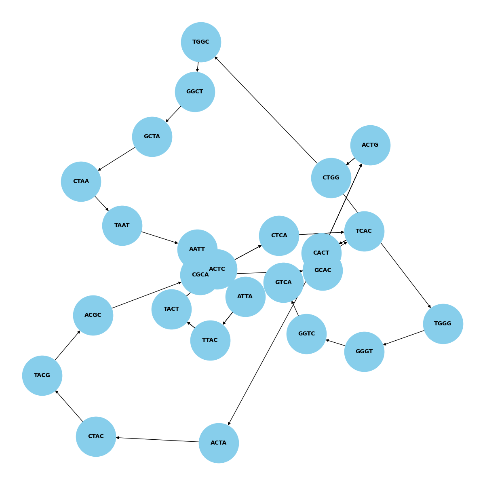
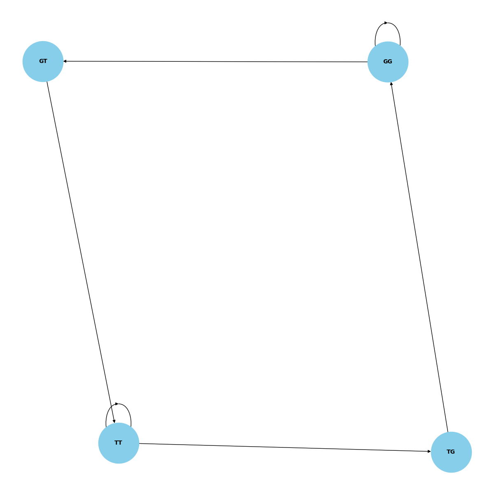
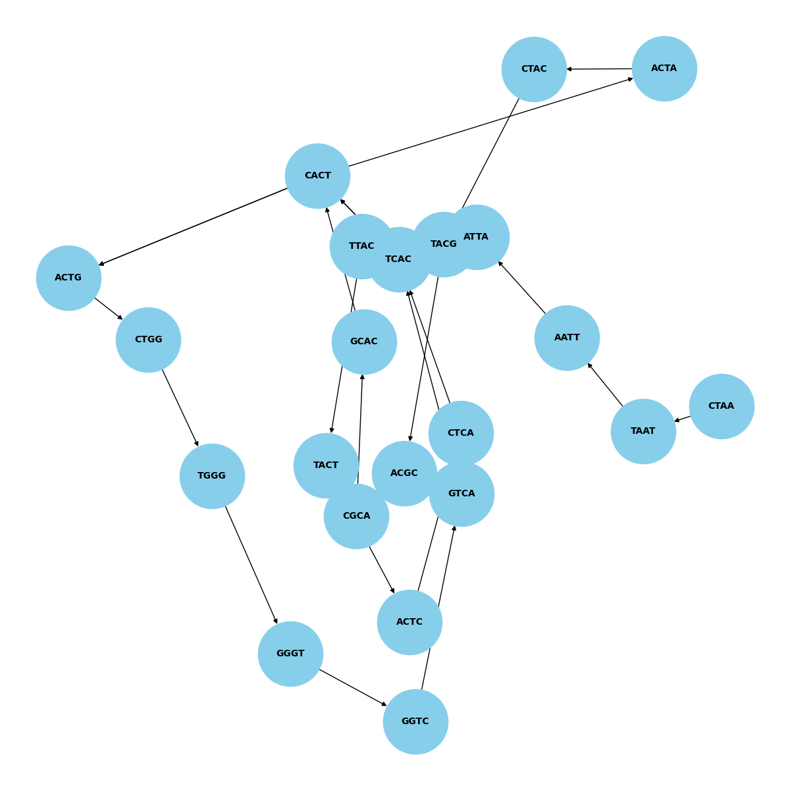
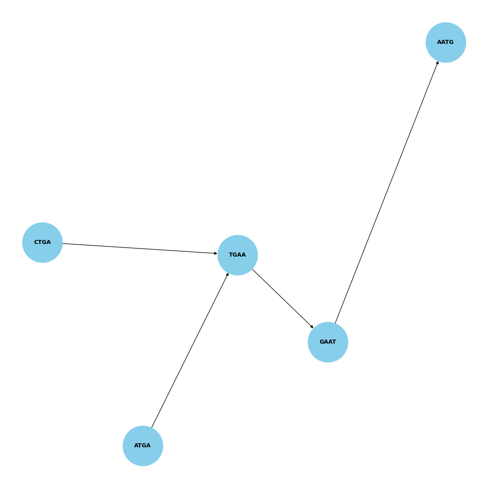

Sure! Here is the updated `README.md` file to include the display of images `DNA_1.png` through `DNA_5.png`:

```markdown
# DNA Sequencing Project

This project involves DNA sequencing and assembly using a de Bruijn graph approach. The code reads DNA segment data, cleans it, constructs a graph, and attempts to reconstruct the DNA sequence.

## Getting Started

### Prerequisites
- Python 3.x
- virtualenv

### Setup

1. **Clone the repository**:
   ```bash
   git clone https://github.com/goodwellmafunga/dna-sequencing-.git
   cd dna-sequencing-
   ```

2. **Create a Virtual Environment**:
   ```bash
   virtualenv venv
   ```

3. **Activate the Virtual Environment**:
   - On Windows:
     ```bash
     venv\Scripts\activate
     ```
   - On macOS/Linux:
     ```bash
     source venv/bin/activate
     ```

4. **Install Required Packages**:
   ```bash
   pip install -r requirements.txt
   ```

## Running the Project

1. **Run the Application**:
   ```bash
   python project.py DNA_4_5.csv
   ```
   This command will process the specified CSV file, generate output files, and create a plot of the de Bruijn graph.

### Example Command
To run the project on a specific dataset, use:
```bash
python project.py path_to_your_dataset.csv
```

## Images

Below are some images related to the project:

### DNA Sequence Graph Example 1


### DNA Sequence Graph Example 2


### DNA Sequence Graph Example 3


### DNA Sequence Graph Example 4


### DNA Sequence Graph Example 5


## Reports

The application generates reports that include DNA sequence graphs, highlighting the structure and relationships within the DNA segments.

## Troubleshooting

If you encounter any issues, make sure to:
- Verify that all required packages are installed.
- Ensure the virtual environment is activated.
- Check that the CSV file paths are correct and accessible.

## Contact

For any issues or inquiries, please contact [mafungag2@gmail.com](mailto:mafungag2@gmail.com).
```
